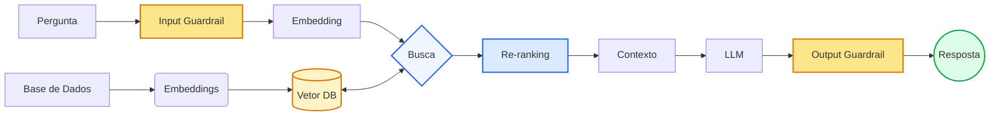

# POC LLM + RAG

## Como Funciona o RAG
No RAG, tudo começa com a leitura da sua base de conhecimento (ex: dados.txt). Esse conteúdo é dividido em pedaços menores (chunks), para facilitar o processamento. Em seguida, cada pedaço é transformado em um vetor numérico usando embeddings — basicamente, o texto vira uma representação matemática que captura o significado dele.

Esses vetores são armazenados em um índice vetorial. Quando o usuário faz uma pergunta, essa pergunta também é transformada em vetor, e o sistema busca no índice os pedaços mais parecidos (mais relevantes semanticamente). Ou seja, ele não procura por palavras iguais, mas por significado parecido.

Por fim, os trechos encontrados são enviados junto com a pergunta para o modelo de linguagem. A LLM usa esse contexto como base para gerar a resposta, evitando “inventar” informações e respondendo com base no conteúdo recuperado.

## LlamaIndex
LlamaIndex é uma biblioteca que facilita a criação de pipelines RAG completos. Na POC, usamos `VectorStoreIndex` com `QdrantVectorStore` para indexar documentos com embeddings e `index.as_query_engine()` para fazer buscas semânticas com alto desempenho.

O objetivo do LlamaIndex é reduzir o código boilerplate de ingestão, parsing e recuperação, deixando você focar na lógica de negócio. Ele suporta vários backends de vetor (Qdrant, Pinecone, Weaviate, ChromaDB), configurações de chunking de texto e mantém a coerência entre consultas e documentos.


## Guardrails
Guardrails são mecanismos de segurança e controle que validam inputs do usuário e outputs do modelo para evitar comportamentos indesejados, como jailbreaks, vazamento de dados, alucinações ou respostas prejudiciais. Na POC, adicionamos guardrails implementando camadas de proteção em três pontos críticos: (1) validação de entrada - filtramos perguntas maliciosas, tópicos sensíveis ou prompts de injeção antes de enviar ao RAG; (2) validação de contexto - verificamos se a resposta gerada está realmente fundamentada nos documentos recuperados, evitando que o modelo fabrique informações; (3) validação de saída - bloqueamos respostas que contenham tokens de conteúdo sensível ou que saiam do escopo definido.

## Re-ranking
Re-ranking é uma técnica de segunda etapa que melhora a qualidade dos resultados de busca. Após a busca inicial por similaridade de embeddings (que retorna os top 10 chunks), usamos um cross-encoder (`sentence-transformers`) para reavaliar e reordenar esses resultados baseado em relevância contextual mais precisa. Isso reduz falsos positivos e garante que apenas os 3 chunks mais relevantes sejam enviados para o LLM, melhorando significativamente a qualidade das respostas.

A implementação está em `rag_service.py` e usa o modelo leve `cross-encoder/ms-marco-MiniLM-L-6-v2` para manter a simplicidade e performance.

## Qdrant (Persistência do Índice)
Qdrant é um banco de dados vetorial usado para armazenar e recuperar embeddings de forma eficiente. Na POC, ele persiste o índice de vetores, evitando recriação a cada execução e melhorando a performance.

Para rodar: `docker run -p 6333:6333 qdrant/qdrant`

O índice é salvo automaticamente na coleção "rag_collection" no Qdrant.

## OpenAI
OpenAI fornece o modelo de linguagem (`gpt-5`) e embeddings usados no projeto. Em `rag_service.py`, `Settings.llm = OpenAI(model="gpt-5", temperature=0.1)` e `Settings.embed_model = OpenAIEmbedding()`.

Esses modelos são consumidos pela aplicação para gerar as respostas e para converter texto em vetores num espaço semântico. Garante-se assim que o RAG consiga comparar com precisão a similaridade entre perguntas e trechos de texto.

## Streamlit
Streamlit é um framework para criar aplicações web em Python de forma rápida. Aqui, `app_streamlit.py` fornece interface visual, histórico de chat e botão de envio, enquanto `main.py` mantém o fluxo de terminal.

A vantagem do Streamlit é que ele abstrai HTML/CSS/JS e permite renderizar componentes interativos diretamente de scripts Python. Isso reduz radicalmente o tempo de desenvolvimento, ideal para POCs e demos como esta.

## Arquitetura



O diagrama reflete o fluxo atualizado da arquitetura RAG com guardrails e re-ranking:

- `Base de Dados` → `Embeddings` → `Vetor DB`
- `Pergunta` passa por `Input Guardrail` (validações de entrada)
- Conversão de pergunta para embedding e busca semântica no vetor
- resultados de busca são reordenados em `Re-ranking`
- `Contexto` entra no `LLM`
- saída do modelo passa por `Output Guardrail` (validações de contexto e saída)
- `Resposta` final é retornada ao usuário

Essa atualização torna explícito o pipeline de segurança e qualidade implementado: filtragem antes e depois do LLM, e reavaliação dos chunks retornados para reduzir falsos positivos e alucinações.

## Como Executar

### Iniciar Qdrant (Docker)
```bash
docker run -p 6333:6333 qdrant/qdrant
```

### Configuração do Ambiente Virtual

1. **Criar ambiente virtual:**
```bash
python3 -m venv venv
```

2. **Ativar ambiente virtual:**
```bash
source venv/bin/activate  # Linux/Mac
# ou
venv\Scripts\activate     # Windows
```

3. **Instalar dependências:**
```bash
pip install -r requirements.txt
```

### Configuração da API Key
1. Copie o arquivo de exemplo: `cp .env.example .env`
2. Edite o arquivo `.env` com sua chave da API do OpenAI:
```
OPENAI_API_KEY=sua_chave_aqui
```

### Opção 1: Chat pelo Terminal
```bash
python main.py
```

### Opção 2: Chat pelo Navegador (Streamlit) 
```bash
streamlit run app_streamlit.py
```

O navegador abrirá automaticamente em `http://localhost:8501` com uma interface amigável para interagir com o chatbot.

### Troubleshooting

**Erro "ModuleNotFoundError":**
- Certifique-se de que o ambiente virtual está ativado: `source venv/bin/activate`
- Reinstale as dependências: `pip install -r requirements.txt`

**Erro de API Key:**
- Verifique se o arquivo `.env` existe na raiz do projeto
- Confirme que a chave da OpenAI está correta: `OPENAI_API_KEY=sk-...`

**Problemas com o modelo "gpt-5":**
- O modelo pode não existir. Tente alterar para `gpt-4` ou `gpt-3.5-turbo` no arquivo `rag/rag_service.py`