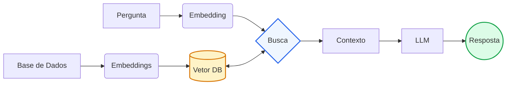

# POC LLM + RAG

## Como Funciona o RAG
No RAG, tudo começa com a leitura da sua base de conhecimento (ex: dados.txt). Esse conteúdo é dividido em pedaços menores (chunks), para facilitar o processamento. Em seguida, cada pedaço é transformado em um vetor numérico usando embeddings — basicamente, o texto vira uma representação matemática que captura o significado dele.

Esses vetores são armazenados em um índice vetorial. Quando o usuário faz uma pergunta, essa pergunta também é transformada em vetor, e o sistema busca no índice os pedaços mais parecidos (mais relevantes semanticamente). Ou seja, ele não procura por palavras iguais, mas por significado parecido.

Por fim, os trechos encontrados são enviados junto com a pergunta para o modelo de linguagem. A LLM usa esse contexto como base para gerar a resposta, evitando “inventar” informações e respondendo com base no conteúdo recuperado.

## Arquitetura



## Como Executar
1. Instale as dependências necessárias:
   ```
   pip install llama-index openai python-dotenv
   ```

2. Crie um arquivo `.env` na raiz do projeto com sua chave da API do OpenAI:
   ```
   OPENAI_API_KEY=sua_chave_aqui
   ```

3. Execute o aplicativo:
   ```
   python main.py
   ```