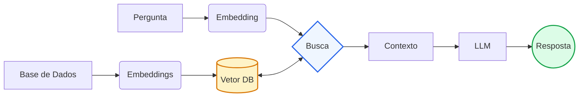

# POC LLM + RAG

## Como Funciona o RAG
No RAG, tudo começa com a leitura da sua base de conhecimento (ex: dados.txt). Esse conteúdo é dividido em pedaços menores (chunks), para facilitar o processamento. Em seguida, cada pedaço é transformado em um vetor numérico usando embeddings — basicamente, o texto vira uma representação matemática que captura o significado dele.

Esses vetores são armazenados em um índice vetorial. Quando o usuário faz uma pergunta, essa pergunta também é transformada em vetor, e o sistema busca no índice os pedaços mais parecidos (mais relevantes semanticamente). Ou seja, ele não procura por palavras iguais, mas por significado parecido.

Por fim, os trechos encontrados são enviados junto com a pergunta para o modelo de linguagem. A LLM usa esse contexto como base para gerar a resposta, evitando “inventar” informações e respondendo com base no conteúdo recuperado.

## LlamaIndex
LlamaIndex é uma biblioteca que facilita a criação de pipelines RAG completos. Na POC, usamos `VectorStoreIndex` para indexar documentos com embeddings e `index.as_query_engine()` para fazer buscas semânticas com alto desempenho.

O objetivo do LlamaIndex é reduzir o código boilerplate de ingestão, parsing e recuperação, deixando você focar na lógica de negócio. Ele suporta vários backends de vetor, configurações de chunking de texto e mantém a coerência entre consultas e documentos.

## OpenAI
OpenAI fornece o modelo de linguagem (`gpt-5`) e embeddings usados no projeto. Em `rag_service.py`, `Settings.llm = OpenAI(model="gpt-5", temperature=0.1)` e `Settings.embed_model = OpenAIEmbedding()`.

Esses modelos são consumidos pela aplicação para gerar as respostas e para converter texto em vetores num espaço semântico. Garante-se assim que o RAG consiga comparar com precisão a similaridade entre perguntas e trechos de texto.

## Streamlit
Streamlit é um framework para criar aplicações web em Python de forma rápida. Aqui, `app_streamlit.py` fornece interface visual, histórico de chat e botão de envio, enquanto `main.py` mantém o fluxo de terminal.

A vantagem do Streamlit é que ele abstrai HTML/CSS/JS e permite renderizar componentes interativos diretamente de scripts Python. Isso reduz radicalmente o tempo de desenvolvimento, ideal para POCs e demos como esta.

## Arquitetura



O diagrama reflete o fluxo de uma arquitetura RAG típica: o conteúdo de `dados.txt` é convertido em embeddings e indexado no `Vetor DB`; a pergunta do usuário também é convertida em embedding, usada para recuperar os trechos mais relevantes, e esse contexto é passado para o LLM, que gera a resposta final. Isso garante que a LLM responda com base em dados reais (não apenas em geração livre) e mantém o ciclo de interação rápido e transparente.

## Como Executar

### Instalação das Dependências
```bash
pip install llama-index openai python-dotenv streamlit
```

### Configuração da API Key
Crie um arquivo `.env` na raiz do projeto com sua chave da API do OpenAI:
```
OPENAI_API_KEY=sua_chave_aqui
```

### Opção 1: Chat pelo Terminal
```bash
python main.py
```

### Opção 2: Chat pelo Navegador (Streamlit) 
```bash
streamlit run app_streamlit.py
```

O navegador abrirá automaticamente em `http://localhost:8501` com uma interface amigável para interagir com o chatbot.